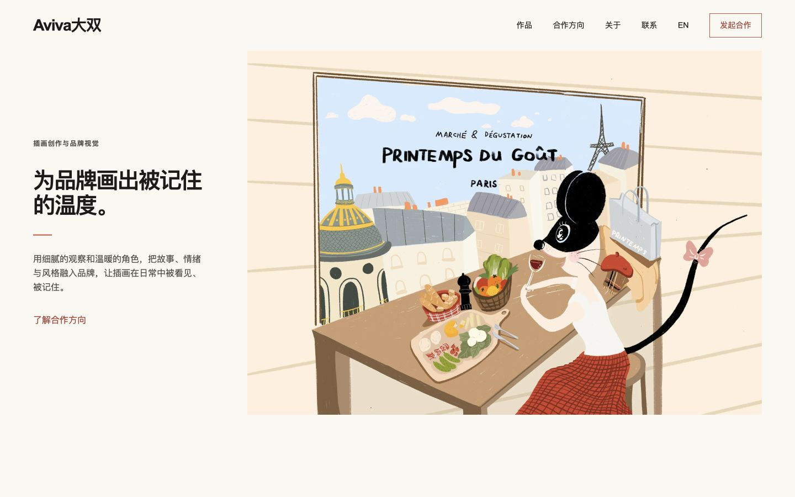
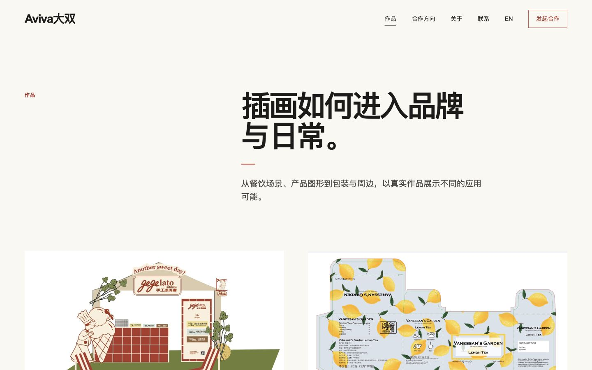
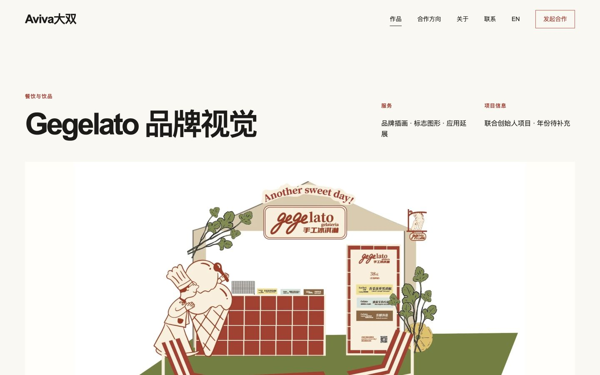
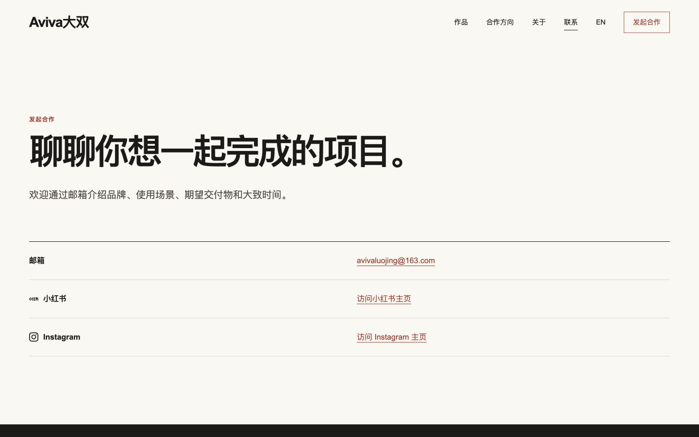
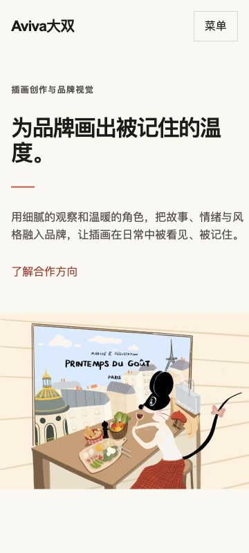

# Aviva大双网站项目文档

> 开发、上线与维护手册  
> 版本：1.0  
> 更新日期：2026-07-20  
> 正式网站：[www.avivaluo.com](https://www.avivaluo.com)  
> 代码仓库：[github.com/ethanzzl/avivaluo](https://github.com/ethanzzl/avivaluo)

## 1. 文档用途

本文件记录 Aviva大双网站从需求确认、视觉选择、素材整理、开发、测试到正式上线的完整流程，也用于约束后续维护。

它主要解决三个问题：

1. 网站为什么这样设计和组织。
2. 后续需要修改时，怎样只改目标位置而避免大面积变化。
3. 正式上线后还应优先补充和改进什么。

## 2. 项目摘要

### 2.1 网站目标

Aviva大双网站是中英双语的插画师作品集和商业合作入口。商业合作是首要目标，主要希望吸引：

- 餐饮、咖啡、茶饮、酒水和食品品牌定制开发
- 品牌插画、包装、菜单、空间和传播视觉
- 插画周边、礼盒、印刷品、服饰和联名产品开发
- 生活方式、编辑出版及其他与画风匹配的合作

首要转化动作是“发起合作 / Start a Project”，其次是“查看作品 / View Work”。

### 2.2 当前成果

- 中文为默认语言，英文使用 `/en/` 路径。
- 首版包含首页、作品列表、7 个作品详情、关于、联系、隐私和 404。
- 从 57 个可公开素材中整理出 7 个项目或合集，首版精选 39 张网页图片。
- 图片已经转换为适合网页使用的衍生文件，原始母版不被覆盖。
- 正式域名已经通过 Vercel 上线。
- GitHub 保存完整版本历史，旧网站另存于 `archive/old-site-2026-07-19` 分支。

### 2.3 已确认的基础信息

- 网站名称：Aviva大双 / Aviva Dashuang
- 本名：罗经
- 身份：插画设计师、创意工作室主理人
- 经历：曾在法国学习生活八年，现工作与生活于上海和天津
- 品牌角色：Fluffy、Gegelato、丛欢酒饭及丛欢意大利小酒馆的联合创始人
- 邮箱：`avivaluojing@163.com`
- 小红书：<https://xhslink.com/m/7SoyMlHCsdd>
- Instagram：<https://www.instagram.com/jingluo_?igsh=NXc4bW9kd2o5OGlj&utm_source=qr>
- 微信和电话：不在网站显示

## 3. 完整开发流程回顾

### 3.1 需求与商业定位

项目先确认网站不是单纯的个人图片档案，而是面向品牌方的合作型作品集。由此确定：

- 作品必须是视觉主体，界面保持克制。
- 先说明作品能为客户带来什么，再补充个人经历。
- 重点展示餐饮、饮品、包装、品牌插画和周边开发能力。
- 不添加博客、会员、支付、复杂筛选、后台等首版不需要的功能。

### 3.2 视觉参考与方向选择

项目参考了国内外插画师个人网站，并重点讨论了温暖、编辑感和作品优先的表达。前两轮方向未被采用，第三版视觉方向最终确认。

已确认的视觉原则：

- 暖白纸张感背景、深色文字、少量红色强调
- 不对称的编辑式排版和充足留白
- 尊重横图、竖图、方图的真实比例
- 不使用模板化卡片墙、重阴影、紫蓝渐变、玻璃拟态
- 不让导航、装饰或动效抢夺插画注意力

参考图只用于校准布局和气质，不作为网页背景或切片使用。

### 3.3 背景资料核对

用户提供的背景文档只用于理解经历与确认事实，没有照搬其中的视觉结构。随后修正并确认：

- 在法国学习生活时间为八年。
- Fluffy、Gegelato、丛欢酒饭及丛欢意大利小酒馆中的角色均为联合创始人。
- 联系方式保留邮箱、小红书和 Instagram，取消微信和电话。

项目始终遵循“不编造客户、年份、成果、评价和数据”的原则。

### 3.4 素材整理与项目分组

素材整理遵循以下步骤：

1. 检查原始插画文件和尺寸。
2. 识别重复内容并保留母版。
3. 按商业应用而不是单纯文件名分组。
4. 将 57 个可公开素材整理为 7 个项目或合集。
5. 按商业理解精选 39 张进入首版，其余保留为候选素材。
6. 生成 WebP 网页衍生图，设置宽高和中英文 alt。
7. 按真实比例编排，不为了网格统一而裁掉主体、文字或签名。

当前项目分组：

1. Gegelato 品牌视觉
2. 柠檬茶包装
3. 巴黎与 Printemps 插画系列
4. 餐饮与空间插画精选
5. 圣诞故事
6. 人物肖像与家庭故事
7. 日常观察

### 3.5 信息架构与双语内容

网站建立了中文与英文对应关系：

| 内容 | 中文路径 | 英文路径 |
| --- | --- | --- |
| 首页 | `/` | `/en/` |
| 作品 | `/work/` | `/en/work/` |
| 项目详情 | `/work/[slug]/` | `/en/work/[slug]/` |
| 关于 | `/about/` | `/en/about/` |
| 联系 | `/contact/` | `/en/contact/` |
| 隐私 | `/privacy/` | `/en/privacy/` |

英文按英文读者的表达习惯重写，不逐字硬译。语言切换应留在当前页面或当前项目。

### 3.6 设计与页面实现

当前网站采用：

- Next.js 16
- React 19
- TypeScript
- 原生 CSS 和响应式布局
- GitHub 版本管理
- Vercel 自动部署

关键文件：

| 文件 | 用途 |
| --- | --- |
| `app/site-data.ts` | 中英文文案、项目资料、图片清单 |
| `app/site.tsx` | 页面结构、导航、页脚、项目详情 |
| `app/globals.css` | 全局视觉、排版和响应式规则 |
| `app/page.tsx` | 中文首页与 SEO |
| `app/[...slug]/page.tsx` | 其他中英文路由与 SEO |
| `public/images/projects/curated/` | 已处理的网页作品图 |
| `tests/rendered-html.test.mjs` | 正式构建后的关键内容与路由测试 |

### 3.7 验证与发布

每次正式发布至少进行：

1. 检查内容真实性和中英文一致性。
2. 运行代码规范检查。
3. 运行生产构建和自动测试。
4. 检查 360px 移动端与桌面端。
5. 检查图片比例、焦点、清晰度和加载。
6. 检查导航、语言切换、联系入口与旧链接重定向。
7. 推送到 GitHub。
8. 等待 Vercel 构建完成。
9. 在 `www.avivaluo.com` 进行上线后抽查。

旧网站在替换前已建立归档分支，因此可以通过 Git 历史回溯。

## 4. 后续小范围修改的沟通方法

### 4.1 最有效的原则

一次只描述一个“修改单元”，并同时告诉我：

1. 改哪个页面或网址。
2. 改哪个具体位置。
3. 现在是什么。
4. 希望改成什么。
5. 哪些内容必须保持不变。
6. 只做预览，还是测试后直接上线。

最好附一张截图，并用圈、箭头或文字说明目标区域。

### 4.2 建议的范围等级

| 等级 | 典型修改 | 风险 |
| --- | --- | --- |
| S 小改 | 一句话、链接、单张图、顺序、局部间距 | 低，可直接验证后上线 |
| M 中改 | 一个区块、一组项目、移动端布局 | 中，需要桌面与移动端复查 |
| L 大改 | 首页结构、视觉系统、网站导航、新功能 | 高，应先出说明或方案再开发 |

如果只想做小改，可以明确说：“这是 S 级修改，只改指定位置，不顺带优化其他内容。”

### 4.3 可直接复制的沟通模板

#### 文案替换

```text
页面：https://www.avivaluo.com/work/项目名
位置：项目简介下方第二段
现在：……
改成：……
保持不变：标题、图片、排版、间距和其他文案
发布方式：先给我确认，再上线
```

#### 删除内容

```text
范围：所有中英文作品详情页
操作：删除“作品公开展示已确认……”这段内部提示
保持不变：项目资料、图片、页面结构和间距
发布方式：测试通过后上线
```

这正是 2026-07-20 本次修改使用的范围：只删除中英文内部提示，不改变其他内容。

#### 替换图片

```text
页面和项目：
替换哪一张：
新图片文件：
希望的顺序：
是否允许裁切：不允许 / 可以轻微裁切
保持不变：文字、其他图片和项目顺序
```

#### 调整排版

```text
页面和截图：
设备：手机 / 桌面，宽度约多少
问题：哪两处没有对齐或哪里太挤
目标：与哪个元素对齐，或希望增加/减少多少留白
保持不变：颜色、字体、图片和其他页面
先做：只调整这一处并给我预览
```

#### 新增项目

```text
项目中英文名称：
客户/品牌：
年份：
我的角色：
服务内容：
项目背景：
交付内容：
图片文件：
是否可公开：
希望放在哪个分类：
```

### 4.4 防止大面积误改的确认句

可以要求我在动手前先回复：

> 请先复述修改范围、会影响哪些文件和哪些内容不会改变；确认是局部修改后再执行。

完成后可以要求我提供：

- 实际修改的文件列表
- 修改前后对比
- 自动测试结果
- 预览或正式网址
- 是否影响中英文、桌面端和移动端

## 5. 当前网站审阅

本次审阅按核心访问路径检查了正式网站：建立第一印象 → 浏览作品 → 查看案例 → 联系合作，同时补充移动端检查。

### 5.1 审阅步骤

1. 首页桌面端：确认定位、代表作品和主要入口。
2. 作品列表桌面端：确认项目层级、作品节奏和浏览效率。
3. 项目详情桌面端：确认案例信息、图片比例和继续浏览路径。
4. 联系页桌面端：确认邮箱和社交入口是否清楚。
5. 首页 360px 移动端：确认导航、文字、图片和横向溢出。

### 5.2 审阅截图

#### 1. 首页桌面端



#### 2. 作品列表桌面端



#### 3. 项目详情桌面端



#### 4. 联系页桌面端



#### 5. 首页移动端



### 5.3 做得好的地方

- 首页能快速表达插画的温暖气质和品牌合作方向。
- 作品面积明显大于界面元素，没有模板感抢夺注意力。
- 作品列表保留不同图片比例，整体有编辑刊物的节奏。
- 项目详情视觉层级清楚，首图与画廊形成连续叙事。
- 联系页非常直接，邮箱、小红书和 Instagram 容易找到。
- 360px 首页未发现明显横向溢出，移动端文字和作品顺序自然。
- 代码中已经包含图片宽高、焦点样式、减少动效支持、canonical、hreflang、sitemap 和 robots 等基础措施。

### 5.4 需要改进的地方

#### P0：上线内容完整度

1. 删除面向内部的提示语“作品公开展示已确认；缺少的客户、年份或合作信息会在确认后补充”。  
   这句话不会阻止技术部署，但会让访客看到制作过程，削弱正式感。本次已经按局部修改处理。

2. 处理仍然公开显示的“待补充”项目资料。  
   当前以下项目仍缺少事实：

   - Gegelato：准确年份
   - 柠檬茶包装：品牌/客户和年份
   - 巴黎与 Printemps：合作信息和年份

   最佳方案是补充真实资料；如果暂时无法确认，应先隐藏不完整的元数据，而不是公开显示“待补充”。

3. 修正英文页面的文档语言标记。  
   当前页面根节点固定为 `lang="zh-CN"`，英文页面也会被辅助技术和搜索引擎识别成中文。需要让 `/en/` 页面输出正确的 `lang="en"`。

#### P1：商业说服力

4. 优先把 3 个最接近商业合作目标的项目补成完整案例：

   - Gegelato 品牌视觉
   - 柠檬茶包装
   - 巴黎与 Printemps 插画系列

   每个案例尽量补充：背景、目标、角色、年份、交付物、创作过程、落地照片，以及可以公开的结果或反馈。没有真实数据时保持空缺，不编写虚构成果。

5. 增加更明确的合作准备信息。  
   联系页可以在不增加表单的前提下说明首次邮件建议包含：品牌/项目、需要的内容、使用场景、预计时间和预算区间。这样能减少来回沟通。

6. 建立项目专属分享图和结构化数据。  
   每个项目可使用自己的封面作为 Open Graph 图片，并补充真实的 `Person`、`CreativeWork` 或 `VisualArtwork` 结构化数据，改善分享和搜索展示。

#### P1：技术与维护

7. 清理旧模板依赖。  
   项目已经使用 Next.js，但依赖清单仍保留 Cloudflare、Vinext、Vite、Drizzle 和 Tailwind 等未使用内容。应在单独的技术维护任务中确认后移除，减少安装体积和未来误解。

8. 继续优化图片交付。  
   当前精选 WebP 总量约 6.3 MB，已经可控；后续可根据真实显示宽度生成多档响应式图片，并评估 AVIF，进一步降低移动端流量。

9. 进行正式的可访问性复核。  
   代码和截图显示基础良好，但仍需实际完成键盘、焦点顺序、对比度、200% 缩放、屏幕阅读器和减少动效测试，才能声明达到 WCAG 2.2 AA。

#### P2：上线后的增长

10. 在需要数据后再添加隐私友好的分析。  
    建议只跟踪访问量、作品详情访问、联系入口点击和语言使用，不采集非必要个人信息；启用前同步更新隐私说明。

11. 建立季度更新节奏。  
    新项目应优先补充真实商业落地、包装、空间或周边照片。每季度检查作品排序，让首页始终展示最符合当前合作目标的项目。

### 5.5 审阅证据范围

本次有截图证据的范围是：首页桌面端、作品列表桌面端、一个项目详情、联系页桌面端和 360px 首页。代码层面另外检查了路由、SEO、图片属性、焦点和 reduced-motion。

本次没有完整覆盖：

- 所有 7 个项目的每张图片
- 768px、1024px 和 1440px 的全部页面
- 真实辅助技术与全键盘流程
- 不同网络速度下的真实用户性能数据
- 所有第三方社交链接在不同地区和设备上的可达性

因此不应仅凭本次截图宣称所有页面完全符合 WCAG 或性能目标。

## 6. 推荐改进顺序

### 上线前或立即处理

- [x] 删除内部“公开展示已确认/信息待补充”说明
- [ ] 补充或隐藏 3 个项目的“待补充”元数据
- [ ] 修正英文页面 `lang` 属性
- [ ] 运行完整构建、测试和正式域名抽查

### 上线后第一阶段

- [ ] 补全 3 个重点商业案例
- [ ] 增加项目专属分享图与真实结构化数据
- [ ] 清理无用依赖和旧模板文件
- [ ] 检查 360、768、1024、1440px
- [ ] 完成键盘、对比度、缩放和屏幕阅读器检查

### 上线后第二阶段

- [ ] 评估隐私友好的访问分析
- [ ] 根据真实访问和询盘调整首页项目顺序
- [ ] 每季度新增或更新 1-3 个高质量项目
- [ ] 每半年检查依赖、安全更新、失效链接和图片性能

## 7. 新项目资料清单

为了让我自动完成大部分整理工作，今后新增项目时只需尽量提供：

- 一个文件夹内的全部原图
- 项目中英文名称（英文没有时我可以先给建议）
- 品牌或客户名称
- 年份
- 你的角色
- 做了哪些内容
- 一至三句话背景
- 是否全部允许公开
- 哪些图片最想优先展示（没有也可以由我按商业价值选择）

我可以自动完成：

- 检查尺寸、格式、重复文件和色彩模式
- 建议分组和图片顺序
- 生成网页衍生图
- 起草中英文项目摘要和 alt
- 更新项目数据和页面
- 检查桌面端与移动端
- 运行测试、提交 GitHub 并核验 Vercel

涉及客户、年份、角色、成果、奖项、报价和授权的事实仍需要你确认。

## 8. 每次发布检查表

### 内容

- [ ] 客户、年份、角色和成果均为真实信息
- [ ] 中文和英文均已更新
- [ ] 没有“待补充”、内部提示或测试文案
- [ ] 联系方式和社交链接有效

### 视觉与图片

- [ ] 360px 无横向溢出
- [ ] 桌面端留白、对齐和图片节奏正常
- [ ] 没有裁掉主体、签名或作品文字
- [ ] 图片清晰但不是未压缩母版

### 功能与可访问性

- [ ] 导航、语言切换和主要 CTA 可用
- [ ] 键盘可以访问所有关键入口
- [ ] 焦点清楚，触控目标足够大
- [ ] 图片 alt 和页面语言正确

### SEO 与发布

- [ ] title、description、canonical、hreflang 正确
- [ ] sitemap、robots、404 正常
- [ ] `npm run lint` 通过
- [ ] `npm test` 通过
- [ ] GitHub 推送成功
- [ ] Vercel 部署成功
- [ ] 正式域名抽查通过

## 9. 回滚与安全

- 不在仓库中保存邮箱密码、平台密钥或其他 Secret。
- 不直接覆盖原始插画母版。
- 重要上线修改通过 Git 提交记录保存。
- 如果新版本出现问题，可以在 Vercel 回退到上一次部署，或通过 Git 恢复对应提交。
- 旧网站保存在 `archive/old-site-2026-07-19`，不应随意删除。

## 10. 当前结论

网站已经具备正式作品集的核心结构、视觉质量和合作入口。最需要提升的不是增加更多功能，而是补全重点案例的真实商业信息、修正英文页面语言标记，并建立稳定的小范围维护流程。

以后修改时，优先采用“明确页面 + 明确位置 + 明确改法 + 明确保持不变内容 + 明确是否上线”的沟通格式。这样可以在不改变整体方向的情况下，持续积累内容和商业说服力。
